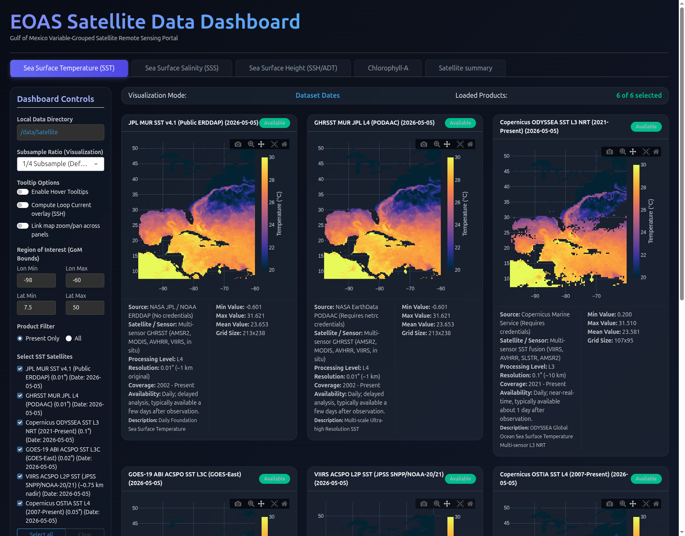
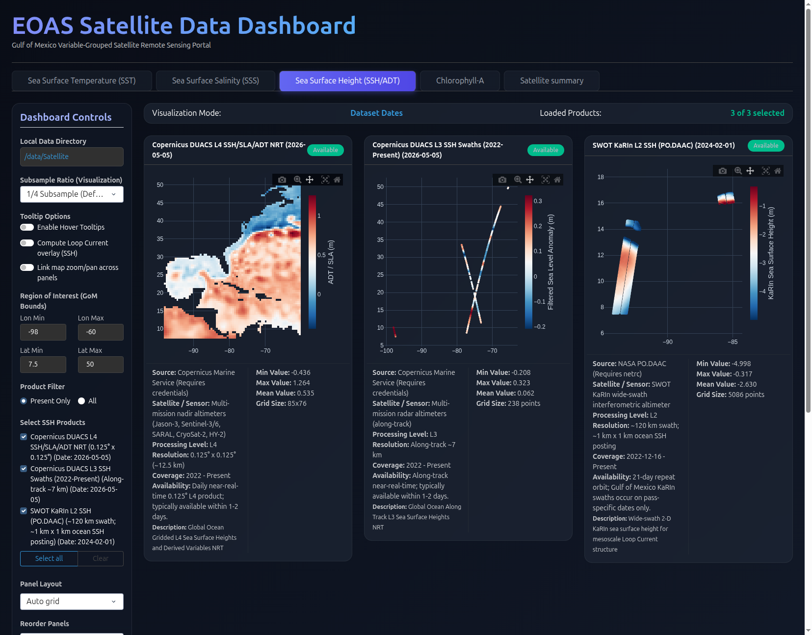
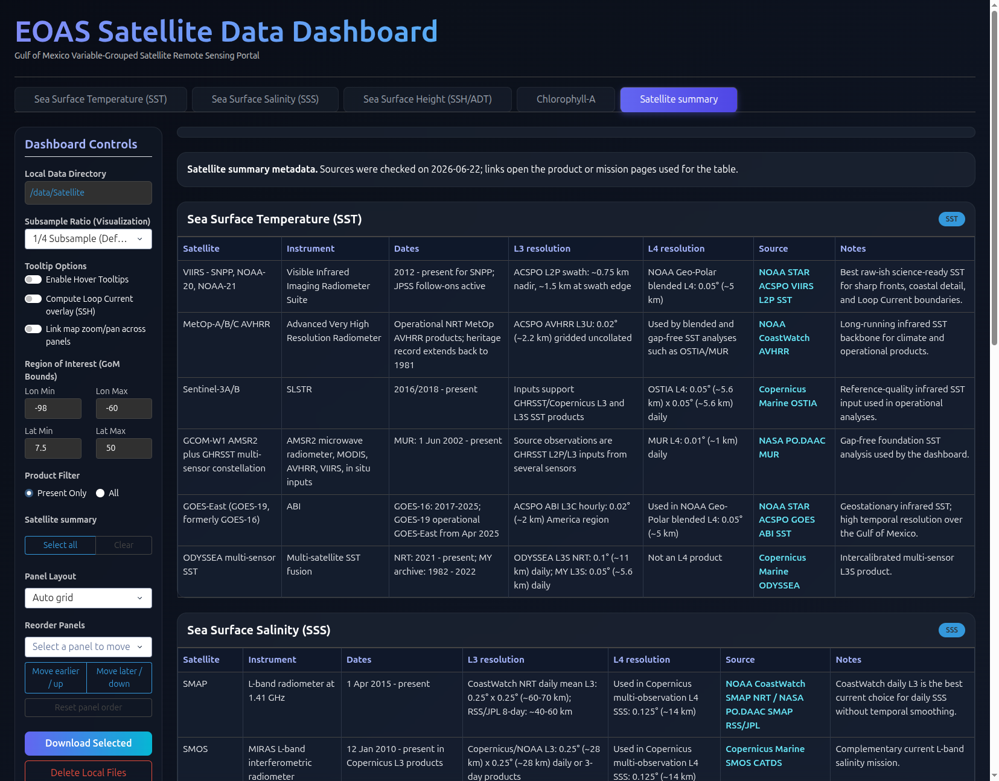

# library-eoas-utils

Python utilities for Earth and Ocean Atmospheric Science (EOAS) workflows: satellite data download, I/O, preprocessing, visualization, and metrics. The repository is designed to be used directly or as a git submodule inside larger modeling and analysis projects.

## Install

Create a conda environment from the provided specification:

```bash
conda env create -f eoas.yml
conda activate eoas
```

Key packages for the interactive dashboard and downloads include `dash`, `plotly`, `xarray`, `netcdf4`, `earthaccess`, and `copernicusmarine`.

Alternatively, use the project virtual environment with [uv](https://github.com/astral-sh/uv) if you already maintain one for EOAS work.

## EOAS Satellite Data Dashboard

The main entry point for browsing, downloading, and visualizing Gulf of Mexico satellite products is `1_download_dashboard.py`. It is a [Dash](https://dash.plotly.com/) web app grouped by oceanographic variable:

| Tab | Variables |
| --- | --- |
| **SST** | MUR, ODYSSEA, GOES ABI, VIIRS ACSPO, OSTIA, and more |
| **SSS** | SMAP (REMSS, CoastWatch, JPL), Copernicus MultiObs |
| **SSH / ADT** | NOAA ERDDAP altimetry, Copernicus DUACS L3/L4, SWOT KaRIn |
| **Chlorophyll-A** | VIIRS, Copernicus OLCI, gap-filled L4 |
| **Satellite summary** | Reference tables of missions, sensors, and resolutions |

### Screenshots

**SST overview** — compare multiple sea-surface temperature products side by side with metadata and grid statistics.



**SSH / ADT tab** — gridded altimetry, along-track swaths, and SWOT wide-swath SSH in one view.



**Satellite summary** — quick-reference tables for current missions, instruments, and data sources.



### Run the dashboard

1. Point the app at your local data root. Create `config.yml` in the repo root (or edit the existing file):

```yaml
download_folder: "/path/to/your/Satellite"
```

If no config file is found, the dashboard falls back to `./test_data/Satellite_Data_Examples`.

2. Start the server:

```bash
python 1_download_dashboard.py
```

3. Open [http://127.0.0.1:8050/](http://127.0.0.1:8050/) in a browser.

### Dashboard features

- **Download / delete / refresh** — fetch selected products for the Gulf of Mexico bounding box without leaving the UI. Downloads run in a separate callback so the map panels stay responsive.
- **Product checklist** — all visible products are selected by default; use **Select all** / **Clear** to adjust.
- **Region of interest** — default bounds cover the Gulf of Mexico (lon −98 to −60, lat 7.5 to 50).
- **Subsample stride** — reduce grid density for faster rendering (default 1/4).
- **Optional overlays** — loop-current contours on SSH panels; linked zoom/pan across panels.
- **Panel layout** — auto grid or fixed columns; drag panels to reorder.
- **Per-panel metadata** — source, sensor, processing level, resolution, availability, and min/max/mean statistics when a local NetCDF file is present.

Product definitions live in `download_data/dashboard_products.py`. Loading and caching logic is in `download_data/dashboard_loader.py` and `download_data/dashboard_cache.py`.

### Credentials

Some products require authentication:

| Provider | Setup |
| --- | --- |
| NASA EarthData / PODAAC | `~/.netrc` for `urs.earthdata.nasa.gov`, or `EARTHDATA_USERNAME` / `EARTHDATA_PASSWORD` |
| Copernicus Marine | `~/.netrc` for the Copernicus machine, or `copernicusmarine login` |
| Public ERDDAP / REMSS | No credentials for many open products |

## Download scripts (CLI)

For scripted or batch downloads without the dashboard, use `download_examples.py`:

```bash
python download_examples.py
```

Individual download modules are under `download_data/` (for example `Download_EARTH_DATA.py`, `Download_COPERNICUS.py`, `Download_SSS_SMAP_satellite.py`, `Download_GOES.py`).

## Repository layout

```
library-eoas-utils/
├── 1_download_dashboard.py      # Dash satellite data portal
├── download_examples.py         # CLI menu for download examples
├── config.yml                   # Local data directory (optional)
├── download_data/               # Download scripts and dashboard metadata
├── io_utils/                    # NetCDF and satellite I/O helpers
├── proc_utils/                  # Preprocessing utilities
├── viz_utils/                   # Plotting helpers
├── tests/                       # pytest suite
└── docs/images/                 # Dashboard screenshots for this README
```

## Usage as a submodule

To include this repo in another project:

1. Add it as a submodule together with *hycom-utils*:

```bash
git submodule add git@github.com:FSU-PULSE/library-eoas-utils.git eoas_pyutils
```

2. Initialize submodules:

```bash
git submodule update --init --recursive
```

3. Add paths in your Python code:

```python
import sys
sys.path.append("eoas_pyutils/")
sys.path.append("eoas_pyutils/hycom_utils/python")
```

4. In your IDE, mark `eoas_pyutils` and `eoas_pyutils/hycom_utils/python` as **source** folders so imports resolve correctly.

## Tests

```bash
pytest tests/
```
